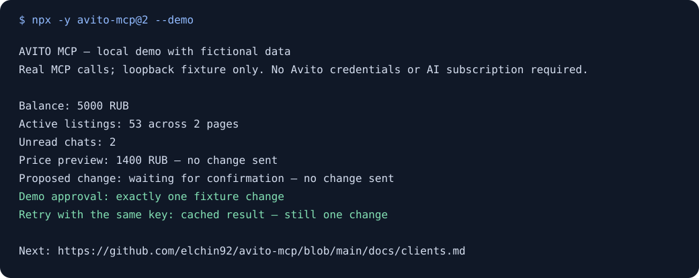

# avito-mcp

[](https://www.npmjs.com/package/avito-mcp)
[](https://www.npmjs.com/package/avito-mcp)
[](https://github.com/elchin92/avito-mcp/actions/workflows/ci.yml)
[](package.json)
[](https://glama.ai/mcp/servers/elchin92/avito-mcp)
[](LICENSE)

**Подключите AI-клиент к своему аккаунту Avito: читайте чаты и статистику, готовьте ответы, управляйте объявлениями и заказами.**

Открытый MCP-сервер: **148 инструментов по 18 официальным API Avito**. Запускается локально через Node.js или на вашем сервере по защищённому HTTP. Модель и выбор действий предоставляет ваш AI-клиент. Для работы по расписанию и автоматических ответов нужен отдельно настроенный агент или планировщик.

**[English version →](README.md)** · [Подключение клиентов](docs/clients.ru.md) · [Сценарии](docs/workflows.md) · [Решение проблем](docs/troubleshooting.md)

> **Новое в v2.1.0:** локальная демонстрация без доступов Avito, профили под задачу и явная обработка неизвестного результата запроса.

## Попробовать без доступов Avito

```bash
npx -y avito-mcp@2 --demo
```

Демонстрация выполняет настоящие MCP-вызовы на вымышленных данных Avito через loopback: отчёт, чаты, предпросмотр цены, подтверждение и повтор с тем же ключом. Доступы Avito не нужны, запросов в Avito нет. Первый запуск `npx` скачивает npm-пакет. Из исходников — `npm run demo`.



## Что можно сделать

| Задача                          | С чего начать                                                                                                                             | Результат                                                                    |
| ------------------------------- | ----------------------------------------------------------------------------------------------------------------------------------------- | ---------------------------------------------------------------------------- |
| Проверить результаты объявлений | [Утренний отчёт](docs/workflows.md#morning-report), [профиль analytics](examples/profiles/analytics.env.json)                             | Баланс, активность и расходы с датами и ID источников                        |
| Разобрать сообщения покупателей | [Непрочитанные чаты](docs/workflows.md#unread-chat-triage), [профиль messenger](examples/profiles/messenger.env.json)                     | Приоритеты и черновики ответов; отправка — отдельное подтверждённое действие |
| Изменить цену объявления        | [Предпросмотр и подтверждение](docs/workflows.md#preview-and-confirm-a-price-change), [профиль seller](examples/profiles/seller.env.json) | Точный запрос, ожидающее действие и проверка результата                      |

Профили используют существующие переменные окружения и показывают агенту небольшой набор нужных инструментов. В сценариях описаны запрос пользователя, инструменты и проверка результата.

## Быстрый старт

Нужны **Node.js 22.12+**, AI-клиент с MCP и доступ к API вашего аккаунта Avito. Получите `Client_id`, `Client_secret` и числовой `Profile_id` через [страницу API Avito](https://www.avito.ru/professionals/api). Доступность методов зависит от прав аккаунта; установка сервера не добавляет прав в Avito.

Для **Claude Desktop** добавьте конфигурацию через Settings → Developer → Edit Config. Для **Cursor** используйте личный `~/.cursor/mcp.json`. Замените три заглушки локально; заполненный конфиг с секретами не добавляйте в Git.

```json
{
  "mcpServers": {
    "avito": {
      "command": "npx",
      "args": ["-y", "avito-mcp@2"],
      "env": {
        "Client_id": "YOUR_CLIENT_ID",
        "Client_secret": "YOUR_CLIENT_SECRET",
        "Profile_id": "YOUR_PROFILE_ID",
        "AVITO_MCP_MODE": "read_only"
      }
    }
  }
}
```

Перезапустите клиент и спросите: **«Через Avito покажи мой баланс и первую страницу активных объявлений. Ничего не меняй».** Пример запускается в `read_only`; без этой настройки сервер по-прежнему использует `full_access`.

**У VS Code, Zed, Codex и ChatGPT свои форматы настройки.** Скопируйте [конфигурацию своего клиента](docs/clients.ru.md), затем попробуйте [сценарий](docs/workflows.md). Примеры фиксируют основную версию 2; для управляемого развёртывания укажите точную опубликованную версию.

## Подключение AI-клиента

| Клиент                     | Готовая конфигурация                                                                  |
| -------------------------- | ------------------------------------------------------------------------------------- |
| Claude Desktop             | [JSON и настройка](docs/clients.ru.md#claude-desktop)                                 |
| Cursor                     | [JSON и настройка](docs/clients.ru.md#cursor)                                         |
| VS Code / Copilot          | [JSON с `servers`](docs/clients.ru.md#vs-code)                                        |
| Zed                        | [JSON с `context_servers`](docs/clients.ru.md#zed)                                    |
| Codex CLI / расширение IDE | [TOML](docs/clients.ru.md#codex-and-chatgpt-desktop)                                  |
| ChatGPT desktop            | [Settings → MCP servers или общий TOML](docs/clients.ru.md#codex-and-chatgpt-desktop) |
| ChatGPT web                | [Удалённые инструменты через плагины](docs/clients.ru.md#chatgpt-web)                 |

Это документированные конфигурации, а не заявление о проверке каждой версии клиента на реальном аккаунте Avito. В отчёте о совместимости укажите версию клиента и ОС.

## Покрытие API

| Область                 | Примеры                                                  |
| ----------------------- | -------------------------------------------------------- |
| Мессенджер              | Чаты, сообщения, изображения, подписки и webhook-события |
| Объявления и статистика | Данные объявлений, цены, просмотры, контакты и расходы   |
| Заказы и остатки        | Статусы доставки, трекинг, ярлыки, маркировка и остатки  |
| Продвижение             | VAS, ставки CPA, прогнозы и заказы продвижения           |
| Автозагрузка            | Загрузка фидов, отчёты и сопоставление ID                |
| Аккаунт и другие API    | Баланс, отзывы, сотрудники, тарифы и звонки              |
| Логистические партнёры  | Методы 3PL-доставки; большинству продавцов не нужны      |

В поставке — 138 Swagger-операций плюс локальные и служебные инструменты. В полном манифесте 148 инструментов; по умолчанию регистрируются 144: выдача токенов и загрузка локальных изображений включаются отдельно. В `read_only` доступны 80 до фильтрации allowlist. Точные имена, схемы и риски доступны через `avito://manifest` или в `dist/manifest.json` после сборки.

Ресурсы содержат манифест, текущие настройки, лимиты, ожидающие подтверждения и webhook-события. Пять встроенных промптов помогают составить обзор, разобрать чаты, подготовить продвижение, объяснить инструмент и проверить настройки безопасности. [Справочник ресурсов и промптов](docs/operations.ru.md#ресурсы-и-промпты).

## Безопасность действий и повторов

- `read_only`, `guarded`, `full_access` и `AVITO_MCP_ALLOW_TOOLS` / `AVITO_MCP_DENY_TOOLS` определяют доступные инструменты.
- `dryRun: true` показывает опасный запрос без отправки. Он не резервирует действие и не проверяет реальные права аккаунта на выполнение.
- Траты и действия, видимые покупателям, по умолчанию требуют двух вызовов. Агент способен сделать оба: это **не доказательство одобрения человеком**. Используйте подтверждения клиента или отдельные механизмы из [настроек безопасности](docs/safety.md).
- `idempotencyKey` исключает повтор одного инструмента с одинаковыми аргументами в пределах настроенного срока хранения. Для того же действия сохраняйте ключ. Если исход неизвестен, сначала сверьте состояние в Avito; новый ключ не заменяет эту проверку.
- Доступы отправляются напрямую в Avito; у проекта нет промежуточного сервера и телеметрии. Результаты инструментов видит ваш AI-клиент, который может передавать их своему провайдеру модели согласно его настройкам.

Рабочие запросы обращаются к реальному аккаунту. Начните с чтения и предпросмотра. [Готовые настройки безопасности](docs/safety.md) описывают подтверждения, ограничения загрузки и восстановление.

## Удалённый MCP по HTTP (OAuth 2.1)

Для размещённого на сервере агента или нескольких клиентов используйте Streamable HTTP на своём HTTPS-домене. Задайте `AVITO_MCP_TRANSPORT=http`, `AVITO_MCP_HTTP_PUBLIC_URL=https://mcp.example.com`, надёжный `AVITO_MCP_OAUTH_OWNER_PASSWORD` и доступы Avito.

[Развёртывание, OAuth, Caddy и nginx](docs/operations.ru.md#удалённый-mcp-по-http-oauth-21). Режимы `bearer` и `none` не заявляют соответствия MCP-спецификации авторизации; для клиентов с автоматическим обнаружением авторизации используйте OAuth.

## Приёмник webhook Avito

Необязательный приёмник сохраняет входящие события Avito в буфер и предоставляет их через инструмент и ресурс с подпиской. Внешний агент должен прочитать события и решить, нужен ли ответ. [Настройка приёмника](docs/operations.ru.md#приёмник-webhook-avito).

## Протокол и совместимость

### Ревизии протокола

`AVITO_MCP_PROTOCOL_ERA` выбирает `legacy` (по умолчанию, MCP 2025-11-25), `dual` (обе ревизии) или `modern` (MCP 2026-07-28). Обычная stdio-установка продолжает отвечать по прежней ревизии; новая включается явно.

`AVITO_MCP_HTTP_MAX_SESSIONS` и `AVITO_MCP_HTTP_SESSION_IDLE_SEC` относятся только к legacy 2025-11-25. Modern HTTP использует `AVITO_MCP_HTTP_MAX_INFLIGHT` и `AVITO_MCP_HTTP_MAX_STREAMS`. [Подробности протокола и лимиты](docs/operations.ru.md#протокол-и-совместимость).

Публичные имена инструментов, документированные допустимые аргументы, переменные окружения, URI ресурсов и имена промптов следуют SemVer. См. [версионирование](docs/operations.ru.md#версионирование), [переход с 1.3.x](MIGRATION.ru.md) и [CHANGELOG](CHANGELOG.md).

## Безопасность

Инструменты выдачи токенов и загрузки изображений скрыты до явного включения. Токены и рабочее состояние хранятся локально с ограниченными правами на файлы. Границы описаны в [настройках безопасности](docs/safety.md), [политике и приватном канале](SECURITY.md) и [диагностике](docs/troubleshooting.md).

## Установка из исходников

```bash
git clone https://github.com/elchin92/avito-mcp.git
cd avito-mcp
npm ci
cp .env.example .env
# Заполните доступы локально.
npm run build:release
```

Настройте клиент на запуск `node /absolute/path/to/dist/server.js`. Передайте доступы через его `env` или укажите абсолютный путь к заполненному `.env` в `AVITO_ENV_FILE`. В репозитории есть [Dockerfile](Dockerfile) и [systemd-установщик](deploy/install-services.sh); перед развёртыванием прочитайте [эксплуатационную документацию](docs/operations.ru.md) и `.env.example`.

Для участников: [CONTRIBUTING](CONTRIBUTING.md) объясняет общую фабрику инструментов и проверки. Перед PR с кодом выполните `npm run verify:release`. CI проверяет типы, тесты, покрытие, установку пакета и развёртывание; smoke-проверка настоящего Avito выполняется отдельно и явно.

## Чего здесь нет

Спецификации Auction, Autostrategy, Autoteka, Jobs, Realty reports и Short-term rent не включены. Проект также не поставляет модель, облачный сервис агента или планировщик. Конкретные задачи для участников — в [roadmap](ROADMAP.md).

Вопросы и ошибки: [GitHub Issues](https://github.com/elchin92/avito-mcp/issues/new/choose) · [Поддержка](SUPPORT.md). Поделитесь воспроизводимым сценарием или улучшите рецепт через pull request.

[MIT](LICENSE). Независимый проект, не связан с Avito. Уведомление о товарном знаке и условиях API — в [NOTICE](NOTICE).
